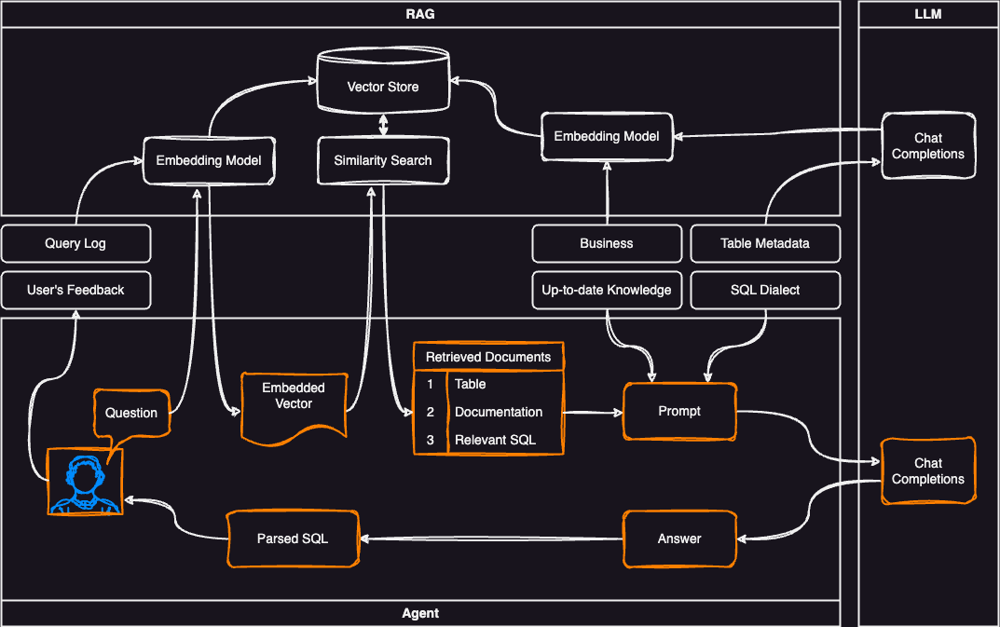

[](https://www.python.org/downloads/release/python-360/)

# sql-helper
Text-to-SQL using LLM and RAG

## How to run

```bash
pip3 install -r requirements.txt

bin/run-local.sh
```


## Development plan

LLM:
- platform:
  - OpenAI ChatGPT
  - Cohere Command R+ ?
  - Claude
  - Meta Llama 3 ?

RAG:
- database:
  - chromadb (standalone)
  - postgres pgvector
- embedding model:
  - sentence transformers:
    - all-MiniLM-L6-v2 (*max len = 256) 
- index (VSS):
  - HNSW
  - IVF-PQ ?

## TODO
- [x] Implement standalone application with ChromaDB
- [x] Implement CRUD with an admin page
- [ ] Set a docker environment
- [ ] Implement a vector store for PGVector

## Architecture

